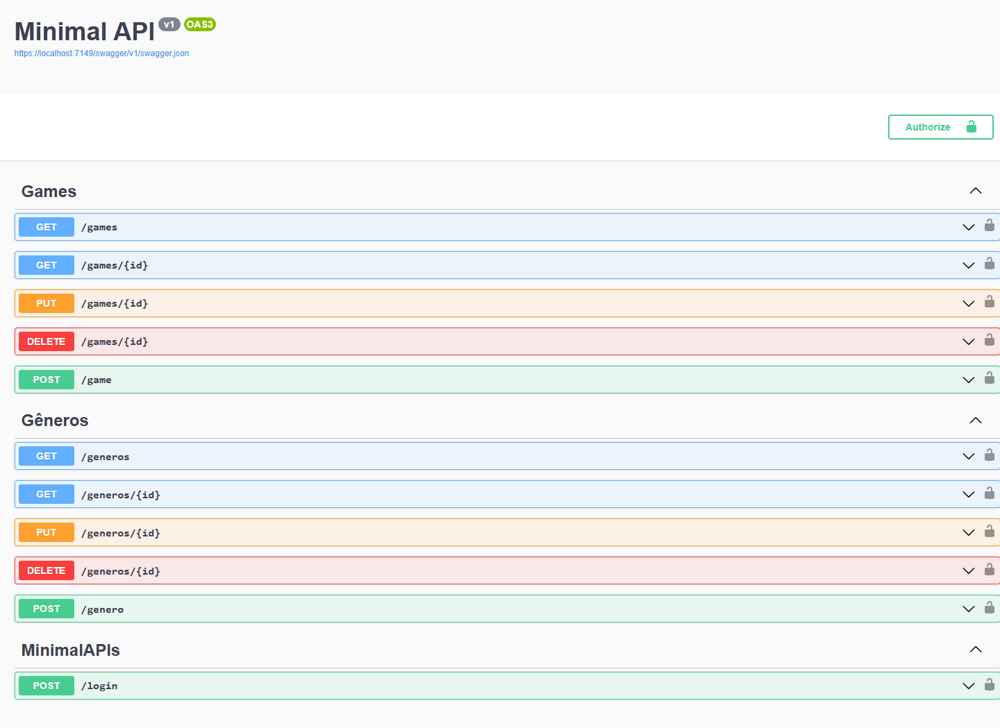

<h1 align="center">.NET 8 MinimalAPI Project</h1>

## 💻 Project

This .NET 8 WebAPI utilizes Minimal APIs to create a simple yet clean endpoint strucure, retrieving data from a SQL Server database using EF Core. It also implements auxiliary libraries such as AutoMapper for data mapping, CarterModule for endpoint registration and FluenAPI to simplify entities mapping in EF Core. The context is a simple CRUD for managing games and their respective genres.

<p align="center">
  
</p>
<p align="center">Source: Created by Author</p>

## ⚙️ Tecnologies
- .NET 8
- Entity Framework Core
- AutoMapper
- Carter Module
- JWT Authorization
- SQL Server
- Swagger

## 🛠️ Tools
- Microsoft Visual Studio 22
- Fork
- Postman
- SQL Server Management Studio 22

## ✅ How to build
The local database will be automatically created after you run the following command in Package Manager Console:
```
Update-Database
```
You can change the database name, port and etc in appsettings.json file.

Then, simply run the project (pay attention to what folder you're in!):
```
dotnet run --project ./MinimalAPIs/MinimalAPIs.csproj
```

## Testing endpoints
To be able to run endpoints that require JWT authorization, you'll have to run '/login' endpoint first OR disable .RequireAuthorization() extension method in the endpoints file. The default login and password are:
```
{
  "userName": "lucas.silva",
  "password": "teste123#"
}
```
You can also change this setting in LoginEndpoint.cs.

Then copy the return token, click "Authorize" button and type in the value field the following: 'Bearer (token)'. All endpoints should now be available to execute!

## :memo: Licence
This project is under MIT License.